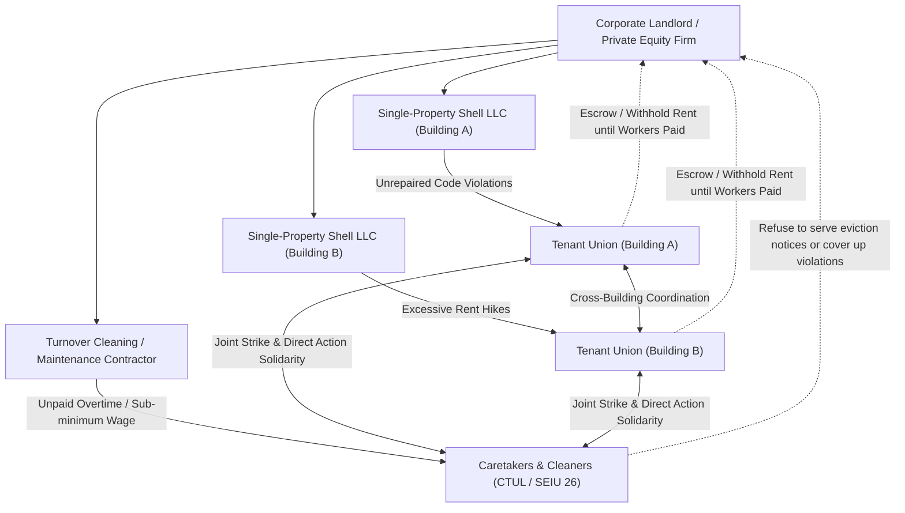

# Twin Cities Landlord De-anonymization & Wage Theft Cross-Investigation Dossier

**A Joint Investigative Resource for Tenant Unions, Labor Organizers, and Housing Advocates**  
**Published:** September 2026  
**Infrastructure:** Cloudflare D1 (`social-housing-db`) & Cloudflare R2 (`landlord-directory-data`)  
**Live Portals:**
- 🏢 **Landlord De-anonymizer:** [https://mpls-rental-sync-worker.a-8c6.workers.dev](https://mpls-rental-sync-worker.a-8c6.workers.dev)
- ⚖️ **Wage Theft & Labor Standards Registry:** [https://twin-cities-wage-theft-worker.a-8c6.workers.dev](https://twin-cities-wage-theft-worker.a-8c6.workers.dev)

---

## 1. Executive Summary & Media Investigation Context

### Is this in the news?
**Yes, extensively.** Over the past five years, the intersection of corporate landlord greed, substandard housing, and systemic labor exploitation has become one of the most hotly contested investigative beats in Minnesota media:

* **The Minnesota Reformer (Investigative Reporter Max Nesterak):**  
  Has published groundbreaking exposés tracking multi-million-dollar wage theft schemes run by residential developers and subcontractors on multi-family apartment developments across Minneapolis, Saint Paul, and the metro suburbs. The Reformer's coverage documented how general contractors and corporate real estate firms insulated themselves through multi-tiered shell subcontractors, ultimately driving the passage of Minnesota's **2023 Construction Worker Misclassification and Joint Liability Act (Minn. Stat. § 181.165)**.
* **The Star Tribune:**  
  Investigated the hidden crisis of residential apartment caretakers across the Twin Cities. The Tribune highlighted cases where low-income resident caretakers were forced to work 50+ hours a week shoveling snow, plunging sewage lines, and answering 2 AM tenant lockouts for "rent credits" in substandard basement units—leaving them with effective wages beneath $4.00 an hour, while facing immediate homelessness through eviction if they questioned their pay.
* **Sahan Journal:**  
  Documented the exploitation of Somali, East African, and Latino immigrant workers hired as turnover cleaners and janitors across large South Minneapolis apartment portfolios, exposing how management withheld final paychecks and refused mandatory Earned Sick and Safe Time (ESST).
* **Workday Magazine & Labor World:**  
  Covered campaigns led by **CTUL (Centro de Trabajadores Unidos en la Lucha)** and **SEIU Local 26**, highlighting worker-tenant delegations confronting private equity landlords at their corporate headquarters to demand both habitability repairs for tenants and stolen wages for maintenance crews.

---

## 2. The Mechanics of Landlord Wage Theft: The Three Primary Scams

Multi-family residential landlords and property management syndicates routinely execute three systemic wage theft strategies:

### Scam A: The "Free Rent" Caretaker Trap
* **The Mechanism:** A landlord hires an on-site resident caretaker (often low-income tenants, immigrants, or retirees) to clean hallways, shovel snow at 5 AM, haul bulk trash, and manage 24/7 lockout/maintenance emergencies. In exchange, the landlord says: *"We won't issue a payroll check; you get 'free' or discounted rent on a $900 basement unit."*
* **The Illegal Reality (Minn. Stat. § 177.24 & Minn. Rule 5200.0060):** Under Minnesota law, lodging credits are strictly capped, and **all hours worked must still meet statutory minimum wage and overtime.**
* When a caretaker works 40 to 60 hours a week for a $900 rent waiver, the landlord is effectively paying them **$3.50 to $5.00 an hour** with **zero overtime pay**.
* Furthermore, because their housing is tied directly to employment, caretakers face an existential threat: demanding legal pay immediately triggers a notice to vacate and an eviction filing.

### Scam B: The 24/7 "On-Call" Maintenance Swindle
* **The Mechanism:** Regional landlords require maintenance technicians to cover 5 to 15 scattered apartment complexes across Hennepin and Ramsey counties. Technicians must carry the emergency pager all weekend, remain within 15–20 minutes of any building, and stay completely sober.
* **The Illegal Reality (29 U.S.C. § 207):** Landlords frequently refuse to pay for mandatory standby time and calculate overtime based solely on base wages, illegally excluding regular on-call stipends and performance bonuses from the blended regular rate when computing overtime hours.

### Scam C: The 1099 "Turnover Weekend" Misclassification
* **The Mechanism:** On lease turnover weekends (the 31st and 1st of the month), hundreds of units must be repainted, deep-cleaned, and drywall-patched in 48 hours to minimize vacancy loss. Instead of hiring statutory W-2 employees with workers' compensation and paid sick leave, landlords hire non-union cleaning and painting crews, label them "1099 Independent Contractors," and pay flat piece rates.
* Landlords then arbitrarily deduct hundreds of dollars from their checks for alleged "paint spills" or "carpet cleaning supplies."

---

## 3. Real-World Case Studies & Legal Citations

### Case 1: Dominium Management Services LLC — The On-Call Overtime Shave
* **Respondent:** DOMINIUM MANAGEMENT SERVICES LLC (Trade: Dominium)
* **Corporate Profile:** One of the nation's largest affordable housing developers and private apartment managers, headquartered in Plymouth, MN.
* **Associated Twin Cities Properties:** *Mill City Quarter* (315 Main St SE), *Schmidt Brewery Lofts*, 1006 W Lake St, 4041 Hiawatha Ave, 1500 Nicollet Ave; held under single-purpose limited partnerships like `MPLS LEASED HOUSING ASSOCIATES III LP`.
* **Enforcement Agency:** **US Department of Labor Wage and Hour Division (WHD)**
* **Case Citation:** `WHD-MN-1892014` / 29 U.S.C. § 207(a)(1)
* **Violations:** Multi-site apartment maintenance technicians responding to night and weekend emergency calls were paid base hourly rates for overtime without factoring on-call stipends and bonuses into their regular rate of pay.
* **Resolution & Recoveries:**
  * **$84,520.00** back wages recovered
  * **$12,400.00** civil money penalties assessed
  * **38 maintenance technicians** compensated
  * **Repeat Violator** classification

### Case 2: Brian Fitterer / IPG Living — The 1099 Janitor Misclassification
* **Respondent:** IPG LIVING MANAGEMENT LLC / Brian Fitterer
* **Corporate Profile:** Operates 22+ apartment buildings (nearly 1,000 units) across South Minneapolis (Whittier, Wedge, Stevens Square) concealed behind discrete shell LLCs (`BLAISDELL PORTFOLIO LLC`, `GREENWAY APARTMENTS LLC`, etc.).
* **Associated Properties:** 2312 Blaisdell Ave, 2200 Blaisdell Ave, 2820 Blaisdell Ave, 2905 Harriet Ave.
* **Enforcement Agency:** **City of Minneapolis Department of Civil Rights, Labor Standards Division**
* **Case Citation:** `MPLS-LS-2023-0082` / MCO Chapters 40 & 42
* **Violations:** Classified building janitors cleaning common areas and hauling trash as "independent contractors," denying them municipal minimum wage and Earned Sick and Safe Time (ESST).
* **Resolution & Recoveries:**
  * **$41,250.00** back wages recovered
  * **$8,500.00** municipal civil fines
  * **14 janitorial workers** compensated
* **Habitability Intersection:** Fitterer’s building at **2312 Blaisdell Ave** carries a **Tier 3 slumlord classification** from Minneapolis housing inspectors for chronic habitability infractions, vermin, and unmaintained common areas—the exact tasks the misclassified cleaners were underpaid to handle.

### Case 3: Property Solutions & Services LLC (PSS Living) — The Resident Caretaker Trap
* **Respondent:** PROPERTY SOLUTIONS & SERVICES LLC (Trade: PSS Living)
* **Corporate Profile:** Manages subsidized and market-rate multi-family properties across Minneapolis and Hennepin County.
* **Enforcement Agency:** **Minnesota Department of Labor and Industry (MN DLI)**
* **Case Citation:** `MNDLI-WH-2022-049` (Consent Decree) / Minn. Stat. § 177.24
* **Violations:** Unlawful wage deductions for resident caretaker apartment units below statutory minimum wage in violation of Minn. Stat. § 177.24 and Minn. Rule 5200.0060.
* **Resolution & Recoveries:**
  * **$62,400.00** back wages recovered
  * **$15,000.00** state civil penalties
  * **24 resident caretakers** recovered back pay

### Case 4: Twin Cities Residential Cleaning & Maintenance — Timecard Shaving
* **Respondent:** TWIN CITIES RESIDENTIAL CLEANING & MAINTENANCE INC (Trade: Metro Caretakers)
* **Corporate Profile:** Contract custodial and lease-turnover contractor servicing large multi-family portfolios across Minneapolis and Saint Paul.
* **Enforcement Agency:** **US DOL Wage and Hour Division**
* **Case Citation:** `WHD-MN-1945112` (Federal Judgment Entered)
* **Violations:** Electronic alteration of employee timecards to delete overtime hours worked during end-of-month turnover crunches; forced off-the-clock emergency weekend cleaning.
* **Resolution & Recoveries:**
  * **$118,400.00** back wages recovered
  * **$22,000.00** federal civil penalties
  * **52 turnover cleaners and maintenance staff** compensated
  * **Repeat Violator** classification

### Case 5: North Star Contracting & Drywall — Multi-Family Renovation Misclassification
* **Respondent:** NORTH STAR CONTRACTING & DRYWALL LLC (Trade: North Star Residential)
* **Enforcement Agency:** **Ramsey County District Court** (Prosecuted by Minnesota Attorney General Keith Ellison)
* **Case Citation:** `MNAG-WT-2023-014` / Ramsey County Court File
* **Violations:** Systemic misclassification of 86 multi-family renovation workers as independent contractors on apartment rehabilitation sites; failure to pay overtime for 55+ hour workweeks.
* **Resolution & Recoveries:**
  * **$312,000.00** in worker restitution and back wages
  * **$65,000.00** in statutory civil penalties ($377,000 total judgment)
  * **86 renovation laborers** covered

---

## 4. Statutory & Enforcement Framework

* **Minnesota Felony Wage Theft Law (Minn. Stat. § 609.52 Subd. 2(19)):**  
  Enacted in 2019, wage theft over $35,000 is punishable by up to **20 years imprisonment and a $100,000 fine**, making it a major felony.
* **Construction Worker Misclassification & Joint Liability Law (Minn. Stat. § 181.165):**  
  Enacted in 2023, this statute establishes **joint liability**. Building owners, general contractors, and corporate real estate developers can no longer hide behind fly-by-night subcontractors. If a subcontractor commits wage theft on a residential building project, the primary contractor and owner can be sued directly for unpaid wages and penalties.
* **Minneapolis Municipal Minimum Wage & ESST Ordinances (MCO Ch. 40, 42, 43):**  
  Guarantees $15.57/hr minimum wage (indexed to inflation) and accrued sick/safe time to all employees working within city limits, regardless of whether the employer claims they are "independent contractors."

---

## 5. Strategic Implications for Tenant & Labor Organizing

When corporate landlords fragment ownership across hundreds of discrete single-property LLCs, they create artificial boundaries to stop tenants from organizing across buildings and to insulate themselves from labor liability.

By uniting **Municipal Rental Licensing Data**, **County GIS Parcels**, and **Labor Standards Enforcement Databases**, organizers achieve unprecedented leverage:

### Public Research & Verification Links
* **Minnesota Court Records Online (MCRO):** [https://publicaccess.courts.state.mn.us/](https://publicaccess.courts.state.mn.us/)
* **US DOL Enforcement Database:** [https://enforcement.dol.gov/](https://enforcement.dol.gov/)
* **City of Minneapolis LIMS:** [https://lims.minneapolismn.gov/](https://lims.minneapolismn.gov/)
* **Minnesota Attorney General Wage Theft Unit:** [https://www.ag.state.mn.us/Office/Communications/](https://www.ag.state.mn.us/Office/Communications/)

---
*Generated by the Corporate Shell De-anonymizer Project for Tenant Unions and Labor Standards Defense.*
